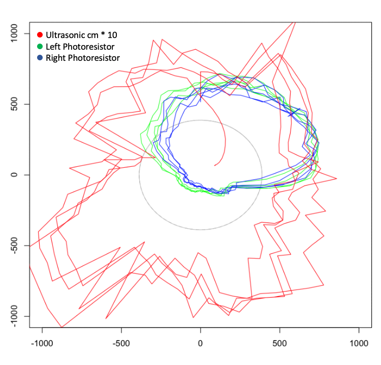

Log Files
=========

Various log files from example runs, including 50ms snapshots of various
sensors:

* Gyro turn rates and accumulated angles
* Accelerometer values with +/- 2g range setting
* Distance from HC-SR04 ultrasonic sensor
* Photoresistors, left & right voltage dividers (1023==5V)

An example plot of a 5' coordinated counter-clockwise turn

Shows photoresistors turning towards and away from desk lamp, positions
of various objects (desk table leg on left). Distance spirals in at the
end of the run as we dropped in an object to trigger stop.
